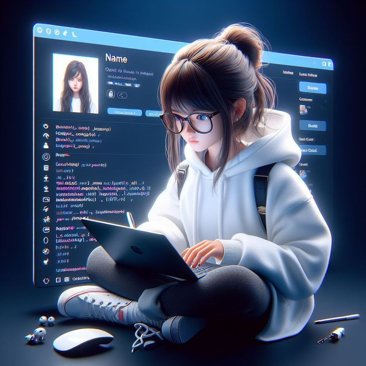

# 👋 Hello there, I'm Roushani

## 🚀 About Me

* 💻 Aspiring Full-Stack Developer
* 🌱 Currently learning Frontend & Backend Development
* 🧠 Building real-world projects to strengthen practical skills
* 🎯 Goal: Become a MERN Stack Developer

---

## 🛠️ Tech Skills

### 🎨 Frontend

* **HTML, CSS** – Creating structured, responsive, and visually appealing web pages
* **JavaScript** – Adding interactivity and dynamic behavior to web applications
* **React** – Building reusable UI components and single-page applications
* **Responsive Design** – Ensuring websites work smoothly across mobile, tablet, and desktop

### ⚙️ Backend

* **Node.js** – Developing server-side logic and scalable backend services
* **Express.js** – Building RESTful APIs and handling server routing efficiently
* **MongoDB** – Managing and storing application data using a NoSQL database
* **REST APIs** – Enabling communication between frontend and backend systems
* **JWT Authentication** – Securing user login and protected routes
* **Socket.io** – Implementing real-time features like instant messaging

---

## 🌐 Connect With Me

  
  

